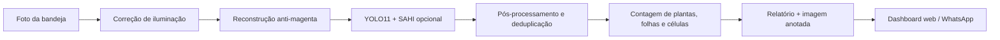

# GerminaVision

Assistente agrícola com visão computacional para analisar bandejas de mudas por foto, via dashboard web ou WhatsApp.

O GerminaVision recebe uma imagem da bandeja, localiza mudas, estima folhas, identifica células visíveis quando a foto permite e devolve um relatório com leitura técnica, imagem anotada e avisos de confiabilidade. A ideia central é simples: transformar uma foto comum, tirada em campo, em uma leitura rápida, útil e honesta sobre germinação.


## Visão Geral

O projeto nasceu para reduzir o trabalho manual de avaliação de mudas em bandejas. Em vez de contar visualmente célula por célula, o usuário envia uma foto e recebe uma leitura estruturada:

- quantidade de plantas localizadas;
- estimativa de folhas por planta;
- total de folhas estimadas;
- taxa de germinação quando a base de células é confiável;
- avisos sobre recorte parcial, grade incompleta, luz roxa/magenta ou leitura insegura;
- imagem anotada com caixas e identificadores;
- histórico de análises no dashboard;
- atendimento e análise automática pelo WhatsApp.

O ponto mais importante do projeto não é apenas detectar plantas. É também saber quando não deve prometer uma taxa que a imagem não sustenta.

## Demonstração

O fluxo no WhatsApp foi pensado para uso direto por alunos, professores e produtores:

1. O usuário envia uma foto da bandeja.
2. O bot responde que está analisando.
3. O sistema processa imagem, iluminação, plantas, folhas e grade.
4. O usuário recebe a imagem anotada e um resumo em linguagem natural.

Exemplo de saída:

```text
Análise da Bandeja - GerminaVision

Resultados:
- No recorte: 10 plantas em 24 células visíveis (41.7%)
- Folhas por planta (média): 2.9
- Total de folhas estimadas: 29

Leitura do recorte visível: a taxa indica quantas células apresentaram muda
na área fotografada, não na bandeja inteira.
```

## Como A Taxa É Calculada

A taxa de germinação pode ter três bases diferentes, dependendo da foto e do contexto informado:

| Situação | Base usada | Exemplo |
| --- | --- | --- |
| O usuário informa o total de células na legenda | Bandeja informada pelo usuário | `128` na legenda |
| A foto mostra um recorte com grade legível | Células visíveis no recorte | `10 plantas em 24 células visíveis` |
| A foto está cortada, sem grade segura ou com luz crítica | Taxa não confirmada | `leitura parcial` |

Essa decisão evita uma armadilha comum: calcular porcentagem apenas em cima das plantas detectadas. Se a taxa fosse baseada somente nas plantas, quase toda imagem pareceria 100%. Por isso o GerminaVision sempre tenta separar:

- **plantas detectadas**, que dizem quantas mudas foram localizadas;
- **células analisáveis**, que dizem qual foi a área de referência;
- **confiabilidade da taxa**, que diz se a porcentagem pode ser usada.

## Pipeline



## Recursos

### Visão Computacional

- Modelo YOLO treinado para classes de germinação e folhas.
- Suporte a análise com imagem inteira e fatiamento opcional com SAHI.
- Deduplicação de detecções próximas.
- Fallback por componentes verdes quando a muda é pequena demais para o modelo.
- Filtros para reduzir falsos positivos em bordas, sujeira e divisórias da bandeja.
- Estimativa de folhas por planta usando sinais detectados e heurísticas visuais.

### Iluminação Difícil

Fotos reais raramente são perfeitas. O projeto trata casos comuns encontrados em viveiros e salas de cultivo:

- correção por Gray World;
- CLAHE para recuperar contraste local;
- normalização para luz roxa;
- reconstrução específica para LED magenta;
- geração de imagem mais natural para visualização;
- aviso explícito quando a iluminação prejudica a confiança.

### Grade E Células

- Detecção de linhas claras da bandeja.
- Contagem de células por grade quando há base visual suficiente.
- Rejeição de recortes pequenos ou células cortadas demais.
- Separação entre taxa da bandeja inteira e taxa do recorte visível.
- Aceite de capacidade informada pelo usuário na legenda da imagem.

### WhatsApp

- Integração com Evolution API.
- QR Code e status de conexão pelo painel.
- Webhook para receber mensagens.
- Fila de processamento para evitar travamento em múltiplas imagens.
- Respostas automáticas para texto e imagem.
- Comandos úteis como `status`, `estatísticas`, `histórico`, `dica` e `ajuda`.

### Dashboard

- Upload manual de imagens.
- Resultado visual com imagem anotada.
- Histórico de análises.
- Estatísticas agregadas.
- Chat agrícola com suporte de LLM.
- Página de configuração do WhatsApp.

## Arquitetura

| Camada | Responsabilidade | Arquivos principais |
| --- | --- | --- |
| API Flask | Rotas web, upload, histórico e status | `app/routes.py`, `run.py` |
| Inferência | Detecção, filtros, grade, folhas e taxa | `app/inference.py` |
| WhatsApp | Webhook, fila, comandos e envio de mídia | `app/whatsapp_routes.py`, `app/evolution_api.py` |
| Persistência | Registro local das análises | `app/database.py`, `data/` |
| Interface | Dashboard, histórico, MCP e WhatsApp | `templates/`, `static/` |
| Modelo | Pesos YOLO treinados | `models/best.pt` |
| Testes | Regressões de grade, luz e fallback | `tests/` |

## Stack

- **Python** para backend, inferência e automações.
- **Flask** para API e dashboard.
- **Ultralytics YOLO11** para detecção de mudas e folhas.
- **OpenCV** para tratamento de imagem, grade e iluminação.
- **Pillow / NumPy** para manipulação de imagens.
- **Evolution API** para WhatsApp.
- **OpenRouter** para o assistente textual agrícola.
- **MCP** como ponto opcional de integração com agentes.

## Requisitos

- Python 3.10 ou superior.
- Modelo treinado em `models/best.pt`.
- Chave OpenRouter para o chat agrícola, se quiser usar o recurso de conversa.
- Evolution API ativa, se quiser usar o WhatsApp.

> O repositório ignora `.env`, pesos `.pt`, uploads e resultados gerados para evitar vazamento de dados locais.

## Rodando com Docker (recomendado para PC Linux local)

A forma mais simples de subir o stack completo (GerminaVision + Evolution API + PostgreSQL + Redis) é via Docker Compose.

### Pré-requisitos

- Docker e Docker Compose instalados.
- Arquivo `models/best.pt` presente no repositório.

### Setup inicial

```bash
cp .env.example .env
# Edite o .env e preencha os valores obrigatorios:
#   EVOLUTION_API_KEY  - chave longa e aleatoria para a Evolution API
#   POSTGRES_PASSWORD  - senha do banco (use apenas letras e numeros)
#   OPENROUTER_API_KEY - chave para o chat agricola (opcional)
#   PUBLIC_BASE_URL    - deixe vazio para usar a rede interna do Docker

docker compose up -d --build
```

> **O `-d` roda o stack inteiro em background.** Nao e necessario deixar o terminal aberto.
> Com `restart: unless-stopped` configurado em todos os servicos, o stack volta
> automaticamente apos reboot do PC. O Docker e o servico: nao e necessario
> launchd, supervisor nem tunnel externo para uso local.

Se faltar `POSTGRES_PASSWORD` ou `EVOLUTION_API_KEY` no `.env`, o `docker compose up` para imediatamente com uma mensagem de erro clara, antes de subir qualquer container.

### Conectar o WhatsApp

1. Abra `http://localhost:5001/whatsapp` no navegador.
2. Clique em **"Conectar WhatsApp"**.
3. Escaneie o QR Code com o celular.

> A Evolution API leva cerca de 15 a 30 segundos para inicializar o Baileys na primeira vez.
> Se o QR vier vazio na primeira tentativa, aguarde alguns instantes e clique novamente.

### Comandos do dia a dia

```bash
# Ver status dos servicos
docker compose ps

# Acompanhar logs em tempo real
docker compose logs -f germinavision

# Parar o stack (sem apagar dados)
docker compose down
```

> **ATENCAO:** nunca use `docker compose down -v`. Esse comando apaga os volumes,
> incluindo a sessao do WhatsApp (exige novo QR scan) e todos os dados do banco PostgreSQL.

### Troubleshooting rapido

- `up` reclama de `POSTGRES_PASSWORD` ou `EVOLUTION_API_KEY`: abra o `.env` e preencha a variavel indicada.
- QR Code nao aparece na primeira vez: a Evolution API ainda esta inicializando. Aguarde 20 segundos e clique em "Conectar WhatsApp" novamente.

## Instalacao (modo Python direto, sem Docker)

```bash
python3 -m venv venv
source venv/bin/activate
pip install -r requirements.txt
cp .env.example .env
python run.py
```

Depois acesse:

```text
http://localhost:5001
```

## Configuracao

As variaveis ficam em `.env`:

| Variável | Obrigatória | Descrição |
| --- | --- | --- |
| `OPENROUTER_API_KEY` | Não | Chave usada pelo chat agrícola. |
| `PUBLIC_BASE_URL` | Sim para WhatsApp | URL pública usada no webhook e envio de mídia. |
| `EVOLUTION_API_URL` | Sim para WhatsApp | URL da Evolution API. |
| `EVOLUTION_API_KEY` | Sim para WhatsApp | Chave da Evolution API. |
| `EVOLUTION_INSTANCE_NAME` | Sim para WhatsApp | Nome da instância WhatsApp. |
| `EVOLUTION_API_HOST_HEADER` | Não | Host header customizado quando necessário. |
| `EVOLUTION_SSL_VERIFY` | Não | Controla verificação SSL em ambientes específicos. |
| `TRAY_CAPACITY` | Não | Capacidade padrão da bandeja quando aplicável. |

Exemplo mínimo:

```env
PUBLIC_BASE_URL=https://seu-tunnel-ou-dominio.com
EVOLUTION_API_URL=https://sua-evolution-api.com
EVOLUTION_API_KEY=sua-chave
EVOLUTION_INSTANCE_NAME=germinavision
```

## WhatsApp

1. Configure as variáveis da Evolution API.
2. Suba a aplicação com `python run.py`.
3. Acesse `/whatsapp`.
4. Conecte a instância pelo QR Code.
5. Envie uma foto da bandeja no WhatsApp.

Comandos reconhecidos:

```text
status
estatísticas
histórico
dica
ajuda
```

O bot também entende mensagens comuns e responde com apoio do assistente agrícola quando a pergunta não é uma imagem.

## API

| Método | Rota | Descrição |
| --- | --- | --- |
| `GET` | `/api/status` | Status da aplicação e do modelo. |
| `POST` | `/api/analyze` | Analisa uma imagem enviada por multipart form. |
| `GET` | `/api/history` | Lista histórico de análises. |
| `DELETE` | `/api/history/<id>` | Remove uma análise do histórico. |
| `GET` | `/api/temporal` | Retorna evolução temporal. |
| `GET` | `/api/stats` | Retorna estatísticas agregadas. |
| `POST` | `/api/chat` | Envia pergunta ao assistente agrícola. |
| `GET` | `/api/whatsapp/status` | Consulta status da integração WhatsApp. |
| `POST` | `/api/whatsapp/connect` | Conecta a instância WhatsApp. |
| `POST` | `/api/whatsapp/disconnect` | Desconecta a instância WhatsApp. |
| `GET` | `/api/whatsapp/qr` | Busca QR Code da instância. |
| `POST` | `/api/whatsapp/webhook` | Recebe eventos da Evolution API. |

Exemplo de análise via `curl`:

```bash
curl -X POST http://localhost:5001/api/analyze \
  -F "image=@/caminho/para/bandeja.jpg" \
  -F "caption=128"
```

## Retreino do modelo (Colab)

[](https://colab.research.google.com/github/nikolasdehor/projetogerminacao/blob/main/colab/train_v4.ipynb)

Clique no badge acima para abrir o notebook de retreino v4 direto no Google Colab. O notebook clona o repositório, monta o Google Drive para persistência de checkpoints e executa o pipeline completo de retreino com YOLO11s.

Após o retreino, baixe o `best.pt` do Colab (ou do Drive em `MyDrive/projetogerminacao/runs/train/`) e commite em `models/best_v4.pt`. Para usar o novo modelo, aponte a variável `MODEL_PATH` no `.env` para `models/best_v4.pt`.

## Treinamento

O projeto inclui scripts auxiliares para preparar e misturar datasets:

| Script | Uso |
| --- | --- |
| `prepare_dataset.py` | Organiza imagens e labels para treinamento. |
| `mix_datasets.py` | Combina bases diferentes em um dataset único. |
| `train.py` | Executa treinamento do modelo YOLO. |

Fluxo típico:

```bash
python prepare_dataset.py
python mix_datasets.py
python train.py
```

O peso final esperado pela aplicação é:

```text
models/best.pt
```

Se esse arquivo não existir, a aplicação pode cair para um modelo base, mas a precisão para mudas não será a mesma de um modelo treinado para o domínio.

## Testes

Execute a suíte de regressão:

```bash
python -m unittest discover -s tests
```

No GitHub Actions, a barreira mínima de CI roda:

```bash
ruff check app tests scripts run.py
python -m compileall -q app run.py tests
pytest -q tests
python scripts/ci_smoke.py
```

No bootstrap inicial, `ruff` e a suíte completa de `pytest` rodam como
baseline não bloqueante no GitHub Actions; `compileall` e o smoke leve são os
gates bloqueantes. Em 2026-06-03, a suíte completa ainda expõe 3 regressões
conhecidas em visão/roteamento que devem ser tratadas antes de promover pytest
para gate obrigatório.

Observação: o smoke de startup completo (`run.py`) não é executado por padrão no CI para não forçar download de modelo YOLO (`best.pt`/`yolo11s.pt`) nem depender de infraestrutura pesada.

Há testes cobrindo pontos sensíveis do projeto, incluindo:

- contagem de células em recortes;
- grade sob luz roxa;
- reconstrução de imagem magenta;
- leitura de mudas pequenas;
- descarte de folhas falsas em bordas;
- decisão de confiabilidade da taxa.

## Estrutura

```text
.
├── app/
│   ├── inference.py          # Pipeline de visão computacional
│   ├── routes.py             # API e dashboard
│   ├── whatsapp_routes.py    # Webhook e comandos WhatsApp
│   ├── evolution_api.py      # Cliente Evolution API
│   └── database.py           # Histórico local
├── data/                     # Banco local gerado em runtime
├── models/                   # Pesos YOLO ignorados pelo Git
├── static/                   # Assets, uploads e resultados
├── templates/                # Telas web
├── tests/                    # Regressões
├── run.py                    # Entrada da aplicação Flask
└── requirements.txt
```

## Limitações

- A análise não substitui avaliação agronômica profissional.
- A taxa da bandeja inteira só é confiável quando a capacidade é informada ou quando a imagem mostra a grade necessária.
- Fotos cortadas podem gerar apenas leitura do recorte visível.
- LED magenta pode ser suavizado, mas não recupera informação visual que foi totalmente perdida na captura.
- Mudas muito pequenas ainda podem depender de fallback visual e validação humana.

## Boas Práticas De Foto

Para melhorar a precisão:

- fotografe a bandeja de cima;
- evite inclinação extrema;
- inclua a maior parte da grade;
- use luz branca ou natural quando possível;
- evite excesso de LED roxo/magenta;
- informe a capacidade da bandeja na legenda quando quiser taxa da bandeja inteira.

Exemplo de legenda:

```text
128
```

## Créditos

Projeto desenvolvido como aplicação prática de visão computacional, automação e inteligência artificial para análise de mudas.

Agradecimento especial ao professor **Vilson Soares de Siqueira** pela orientação, pelos desafios propostos e pela oportunidade de transformar uma necessidade real em uma solução funcional.

## Autor

**Nikolas DeHor**

Projeto experimental e educacional voltado para agricultura, automação e IA aplicada.
