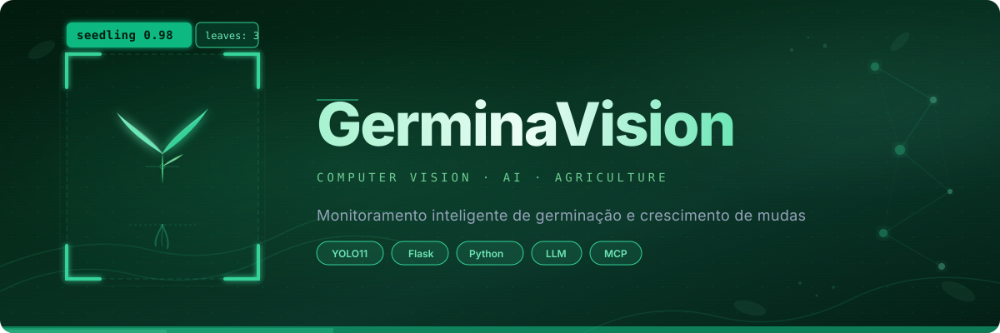

# GerminaVision



> Sistema de visão computacional para monitoramento de germinação e crescimento de mudas em bandejas. Detecta plantas e folhas via YOLO11, com dashboard web interativo e integração WhatsApp em tempo real.

## Sumário

- [Visão geral](#visão-geral)
- [Arquitetura](#arquitetura)
- [Pré-requisitos](#pré-requisitos)
- [Setup passo a passo](#setup-passo-a-passo)
- [Como usar](#como-usar)
- [Endpoints da API](#endpoints-da-api)
- [Treino de modelo próprio](#treino-de-modelo-próprio)
- [Troubleshooting](#troubleshooting)
- [Estrutura do projeto](#estrutura-do-projeto)
- [Créditos](#créditos)

---

## Visão geral

GerminaVision é uma plataforma completa de monitoramento de mudas em bandejas usando visão computacional. O sistema detecta automaticamente plantas germinadas e folhas individuais em imagens capturadas de bandejas de cultivo, fornecendo métricas em tempo real como taxa de germinação, contagem de folhas por planta e estágio fenológico.

O modelo foi treinado em um dataset misto combinando imagens públicas (Roboflow: brócolis e couve-flor) com fotos proprietárias de morango, cobrindo casos de uso reais em produção comercial e pesquisa. Detecta duas classes principais:

- **Germinação**: muda germinada com caule e folhas visíveis
- **Folha**: folha individual, usada para calcular desenvolvimento relativo

A plataforma oferece três interfaces:

1. **Dashboard web**: upload de foto, análise visual, histórico de monitoramento e chatbot de dicas
2. **WhatsApp**: enviar fotos diretamente pelo celular, receber análises automáticas
3. **API REST**: integração com sistemas de gestão agrícola ou aplicações customizadas

---

## Arquitetura

```
┌─────────────────┐
│  Usuário Mobile │ (WhatsApp)
└────────┬────────┘
         │ Foto
         ▼
┌──────────────────────────────┐
│  Evolution API (VPS)         │ (Hostinger)
│  - Recebe + enfileira msgs   │
└────────┬─────────────────────┘
         │ Webhook (cloudflared)
         ▼
┌──────────────────────────────┐
│  Flask Local (5001)          │
│  ┌────────────────────────┐  │
│  │ YOLO11 Inference       │  │
│  │ (detecção + contagem)  │  │
│  └────────────────────────┘  │
│  ┌────────────────────────┐  │
│  │ Chatbot IA             │  │
│  │ (OpenRouter)           │  │
│  └────────────────────────┘  │
│  ┌────────────────────────┐  │
│  │ SQLite Database        │  │
│  │ (histórico análises)   │  │
│  └────────────────────────┘  │
└──────────────────────────────┘
         │ Resposta
         ▼
┌──────────────────────────────┐
│  Dashboard Web (localhost)   │
│  + Histórico de análises     │
└──────────────────────────────┘
```

### Componentes principais

| Arquivo | Responsabilidade |
|---------|------------------|
| `run.py` | Entry point Flask, inicia servidor na porta 5001 |
| `app/__init__.py` | Factory pattern, registra blueprints e carrega modelo |
| `app/routes.py` | Endpoints HTTP: dashboard, análise de imagens, histórico |
| `app/whatsapp_routes.py` | Webhook Evolution API, processa mensagens WhatsApp |
| `app/whatsapp.py` | Cliente Evolution API, cria instância e envia mensagens |
| `app/inference.py` | Pipeline YOLO11, detecção e contagem de folhas por planta |
| `app/chatbot.py` | Chatbot IA (OpenRouter), dicas personalizadas por contexto |
| `app/database.py` | SQLite, persiste análises e série temporal |
| `prepare_dataset.py` | Fatiamento LabelMe + tiles YOLO, conversão de anotações |
| `mix_datasets.py` | Mescla dataset Roboflow (público) + morango (próprio) |
| `train.py` | Treino YOLO11 local (Metal/MPS no Mac ou CUDA/CPU) |

---

## Pré-requisitos

### Sistema operacional

- macOS 12+ ou Linux (x86_64 ou ARM64)
- Windows 10+ via WSL2 (sem suporte a Metal; use CPU ou CUDA)

### Ferramentas

- **Python 3.11+** (testado em 3.14 no macOS)
- **Homebrew** (macOS): para instalar `cloudflared`
- **Git**: para clonar o repositório
- Approx. **10 GB de espaço em disco** (modelos + datasets + runs de treino)

### Contas online (gratuitas)

- **OpenRouter**: chatbot IA (modelos: Llama 3.3, GLM-4, Qwen)
  - Inscrever-se: https://openrouter.ai
  - API key: criar em https://openrouter.ai/keys

- **Evolution API**: gerenciar WhatsApp
  - Serviço gratuito em VPS própria (ex: Hostinger) ou provedor tercerizado
  - Alternativa pronta: chatwoot, n8n, ou similar

- **Roboflow** (opcional): apenas para re-baixar dataset público
  - Inscrever-se: https://roboflow.com
  - Dataset público: `eshu-broccoli/seedling-f9rmf`

---

## Setup passo a passo

### 1. Clone e dependências

```bash
# Clone o repositório
git clone https://github.com/nikolasdehor/projetogerminacao.git
cd projetogerminacao

# Crie virtualenv
python3 -m venv venv
source venv/bin/activate  # macOS/Linux
# ou no Windows:
# venv\Scripts\activate

# Instale dependências Python
pip install -r requirements.txt

# No macOS, instale cloudflared para tunnel público
brew install cloudflared
```

### 2. Configure variáveis de ambiente

Copie `.env.example` para `.env`:

```bash
cp .env.example .env
```

Abra `.env` e preencha os valores reais:

```bash
# OpenRouter - onde obter: https://openrouter.ai/keys
OPENROUTER_API_KEY=sk-or-v1-abc123...

# Evolution API - URL e chave da sua instância
EVOLUTION_API_URL=https://your-evolution-instance.example.com
EVOLUTION_API_KEY=<SUA_API_KEY>

# Nome livre para a instância WhatsApp dentro da Evolution
EVOLUTION_INSTANCE_NAME=germinavision

# (Opcional) Capacidade da bandeja - padrão 200 para bandejas de morango
# TRAY_CAPACITY=200
```

**Onde obter cada uma:**

- **OPENROUTER_API_KEY**: Log em https://openrouter.ai, vá para "API Keys", copie a chave
- **EVOLUTION_API_URL e KEY**: Se usando Hostinger ou VPS, acesse o painel Evolution API, copie URL e global API key
- **EVOLUTION_INSTANCE_NAME**: escolha um nome único (exemplo: `germinavision`, `bandeja-01`)

### 3. Dataset

#### Opção A: Usar dataset pré-treinado pronto

Se você tem um `best.pt` já treinado ou quer usar o modelo YOLO11 pré-treinado (COCO):

```bash
# Apenas crie a pasta de modelos
mkdir -p models

# Se tem best.pt, copie para:
# cp seu_modelo_antigo/best.pt models/best.pt

# Senão, o sistema carregará yolo11s.pt automaticamente na primeira inferência
```

#### Opção B: Preparar dataset do zero e retreinar

O projeto inclui dois datasets:

1. **Roboflow público** (`eshu-broccoli/seedling-f9rmf`): ~768 imagens de brócolis e couve-flor
2. **Morango próprio**: ~512 tiles extraídos de fotos LabelMe de 4000 x 1848 px (fatiadas em grade 4 x 2)

**Passo 1: Baixe dataset Roboflow**

```bash
# Instale Roboflow CLI
pip install roboflow

# Baixe o dataset (requer Roboflow account)
python -c "
from roboflow import Roboflow
rf = Roboflow(api_key='SUA_CHAVE_ROBOFLOW')
project = rf.workspace('eshu-broccoli').project('seedling-f9rmf')
dataset = project.download('yolov8')
"
```

**Passo 2: Prepare dataset de morango (LabelMe para YOLO)**

Se você tem imagens anotadas em LabelMe (PNGs + JSONs) em `_source_pngs/`:

```bash
# Converte polígonos LabelMe -> bboxes YOLO, fatia em tiles 4x2
python prepare_dataset.py
```

Isso cria a estrutura esperada em `dataset/`:
```
dataset/
├── train/
│   ├── images/
│   └── labels/
├── valid/
│   ├── images/
│   └── labels/
├── test/
│   ├── images/
│   └── labels/
└── data.yaml
```

**Passo 3: Mescle Roboflow + morango**

```bash
# Combina os dois datasets (6 classes Roboflow -> 2 classes YOLO, 2 do morango)
python mix_datasets.py
```

Resultado final:
- Classes: `[Germinacao, Folha]`
- Proporção aprox: 70% treino, 20% validação, 10% teste
- Total: ~1.280 imagens

### 4. Treino

**Opção A: Local no Mac (recomendado se tem Apple Silicon)**

```bash
source venv/bin/activate
python train.py
```

Parâmetros padrão:
- Epochs: 100 (com early stopping no epoch 51)
- Batch size: 4 (reduzido para evitar OOM em Mac)
- Device: Metal (MPS) se disponível
- Tempo estimado: ~3 horas

Modelo treinado salvo automaticamente em `models/best.pt`.

**Opção B: Google Colab (GPU gratuita)**

Abra e execute o notebook:
```
colab_monitoramento_germinacao.ipynb
```

1. Faça upload de `dataset/` para Drive
2. Execute células do treino
3. Download de `best.pt` ao final
4. Copie para `models/best.pt` no seu ambiente local

**Opção C: Usar modelo pré-treinado YOLO11 (sem treino)**

Se não treinar, o sistema usa `yolo11s.pt` (COCO) automaticamente. Resultado: detecção genérica (menos precisa para mudas em bandejas).

### 5. Inicie o servidor Flask

```bash
source venv/bin/activate
python run.py
```

Saída esperada:
```
🌱  Sistema de Monitoramento de Germinação
   Acesse: http://localhost:5001
```

Verifique se funciona:
```bash
curl http://localhost:5001
# Deve retornar a página HTML do dashboard
```

### 6. Crie tunnel público (cloudflared)

Em outro terminal (com `venv` ativo):

```bash
cloudflared tunnel --url http://localhost:5001
```

Aparecerá uma URL como:
```
https://XXXXX.trycloudflare.com
```

**Essa URL é pública e acessível do WhatsApp/internet.** Copie-a - você vai usar no próximo passo.

**Para tunnel permanente** (URL fixa):

Consulte https://developers.cloudflare.com/cloudflare-one/connections/connect-networks/

### 7. Conecte WhatsApp (Evolution API)

Abra um novo terminal e execute:

```bash
# Substitua XXXXX.trycloudflare.com pela URL real
WEBHOOK_URL="https://XXXXX.trycloudflare.com/whatsapp"

# Crie instância
curl -X POST "http://localhost:5001/api/whatsapp/connect" \
  -H "Content-Type: application/json"
```

O sistema retorna um QR code. **Escaneie com seu celular** (WhatsApp Web):

```bash
# Verifique se está conectado
curl http://localhost:5001/api/whatsapp/status
# Resposta esperada: {"state": "open"}
```

Registre webhook na Evolution (automático via `/api/whatsapp/connect`, mas pode configurar manualmente):

```bash
INSTANCE_NAME="germinavision"  # seu nome de instância

curl -X POST "$EVOLUTION_API_URL/webhook/set/$INSTANCE_NAME" \
  -H "Content-Type: application/json" \
  -H "apikey: $EVOLUTION_API_KEY" \
  -d "{\"webhook\": \"$WEBHOOK_URL/webhook\"}"
```

---

## Como usar

### Dashboard web

1. Abra http://localhost:5001 no navegador
2. **Envie uma foto**: clique em "Upload" ou arraste uma imagem de bandeja (PNG, JPG, WEBP)
3. **Veja análise**: o sistema detecta plantas/folhas e mostra:
   - Bounding boxes coloridas (verde = germinação, amarelo = folha)
   - Taxa de germinação (%)
   - Contagem média de folhas por planta
   - Tempo de inferência
4. **Histórico**: abaixo aparece todas as análises anteriores com timestamps
5. **Chatbot**: faça perguntas sobre germinação, condições de cultivo, etc.

### WhatsApp

1. **Abra WhatsApp** no seu celular
2. **Encontre o contato** (número de telefone registrado na Evolution)
3. **Envie uma foto** da bandeja
4. **Espere análise**: em segundos, recebe:
   - Imagem anotada com detecções
   - Taxa de germinação
   - Dica personalizada do chatbot IA
5. **Comandos de texto**:
   - `status` - mostra último resultado
   - `histórico` - últimas 5 análises
   - `dica` - dica aleatória sobre germinação
   - `ajuda` - lista de comandos
   - Qualquer outro texto - chatbot responde

### API REST (para integração)

Veja [Endpoints da API](#endpoints-da-api).

---

## Endpoints da API

### Status e Diagnóstico

```
GET /api/status
Retorna: {
  "status": "ok",
  "model_loaded": true,
  "custom_model": true,
  "model_path": "/path/to/models/best.pt",
  "message": "Modelo personalizado ativo ✅"
}
```

```
GET /api/whatsapp/status
Retorna: { "state": "open" } ou { "state": "closed" }
```

### Análise de Imagens

```
POST /api/analyze
Content-Type: multipart/form-data

Parâmetros:
  image: <arquivo .png/.jpg/.webp>
  day_label: (opcional) descrição do dia (ex: "Dia 5 - pós-semeadura")

Retorna: {
  "total_detected": 45,
  "germinated": 28,
  "germination_rate": 14.0,
  "leaves_total": 68,
  "leaf_avg": 2.4,
  "leaf_counts": [2, 3, 2, 1, ...],
  "tray_capacity": 200,
  "detections": [
    {
      "class": "Germinacao",
      "confidence": 0.95,
      "bbox": [100, 200, 150, 250],
      "germinated": true,
      "leaf_count": 3
    },
    ...
  ],
  "result_image": "/static/results/result_abc123.jpg",
  "inference_time_s": 1.23
}
```

### Histórico

```
GET /api/history?limit=10
Retorna: [
  {
    "id": 1,
    "timestamp": "2026-05-13T20:30:15",
    "day_label": "Dia 5",
    "germination_rate": 14.0,
    "leaf_avg": 2.4,
    "result_image": "/static/results/result_abc123.jpg"
  },
  ...
]
```

```
GET /api/temporal
Retorna série temporal (taxa de germinação por dia)
```

### Chatbot

```
POST /api/chat
Content-Type: application/json

Body: {
  "message": "Como aumentar a taxa de germinação?",
  "context": {
    "germination_rate": 60.0,
    "leaf_avg": 2.5,
    "last_analysis": "2026-05-13T20:30:15"
  }
}

Retorna: {
  "response": "A taxa de germinação depende principalmente...",
  "model_used": "openrouter/auto"
}
```

### WhatsApp (evolução)

```
POST /api/whatsapp/connect
Cria/recria instância e gera QR code
```

```
POST /whatsapp (webhook)
Evolution API chama este endpoint com mensagens recebidas
```

---

## Treino de modelo próprio

Se quiser melhorar a detecção com suas próprias fotos:

### 1. Colete imagens

Tire fotos de bandejas reais em diferentes:
- Ângulos (frontal, lateral, de cima)
- Iluminações (natural, LED, mista)
- Culturas (morango, alface, tomate, etc.)
- Estágios (pré-emergência até 4-5 folhas)

Mínimo recomendado: **100 imagens por classe**

### 2. Anote com LabelMe

Instale LabelMe:
```bash
pip install labelme
labelme
```

Para cada imagem:
1. Abra em LabelMe
2. Desenhe polígonos ao redor de:
   - Plantas germinadas - label `Germinacao`
   - Folhas individuais - label `Folha`
3. Salve como JSON (automático)

Estrutura de saída:
```
_source_pngs/
└── 2026-05-13/
    ├── imagem_01.png
    ├── imagem_01.json
    ├── imagem_02.png
    ├── imagem_02.json
    └── ...
```

### 3. Prepare dataset

```bash
python prepare_dataset.py
```

Isso:
- Converte polígonos -> bboxes normalizadas YOLO
- Fatia em tiles 4 x 2 (para aumentar samples)
- Faz split automático train/valid/test
- Gera `data.yaml`

### 4. Retreine

```bash
python train.py
```

Monitore:
```bash
# Em outro terminal
tensorboard --logdir runs/detect/train
```

Métricas importantes:
- **mAP50**: % de detecções corretas (threshold 50% IOU)
- **mAP50-95**: média em thresholds 50%-95% (mais rigoroso)
- **Precision/Recall**: trade-off entre falsos positivos e negativos

Objetivo: **mAP50 > 0.85** para produção.

### 5. Implante

```bash
cp runs/detect/train/weights/best.pt models/best.pt
python run.py  # Recarrega novo modelo automaticamente
```

---

## Troubleshooting

| Problema | Causa | Solução |
|----------|-------|---------|
| **Flask 502 Bad Gateway** | Cloudflared caiu ou desconectou | Reinicie `cloudflared tunnel --url http://localhost:5001` em novo terminal |
| **WhatsApp state=closed** | QR code expirou (~60s) | Execute `curl http://localhost:5001/api/whatsapp/connect` e escaneie novo QR |
| **mAP baixo no treino** | Dataset desbalanceado ou pequeno | Adicione mais imagens (mín. 100/classe), aumente epochs, reduza `imgsz` |
| **OOM no treino (killed)** | Memória insuficiente | Reduza `batch=2`, `imgsz=416` no `train.py`, ou use Colab |
| **Chatbot responde "429"** | Rate limit OpenRouter (free tier) | Espere 20s entre requisições ou upgrade para conta paga |
| **"*asterisco*" literal na resposta** | Resposta com Markdown não renderizada no WhatsApp | Chatbot já evita Markdown, mas se persistir, reabra conversação (`/reset`) |
| **CloudFlare URL muda a cada restart** | Usando quick tunnel (efêmero) | Para URL fixa: configure tunnel nomeado em https://dash.cloudflare.com |
| **Modelo não carrega** | `best.pt` corrompido ou caminho errado | Verifique `models/best.pt` existe e tem >100 MB; senão, retreine |
| **Imagem não analisa** | Formato não suportado ou arquivo corrompido | Use PNG, JPG ou WEBP; verifique se a imagem abre normalmente |
| **Nenhuma detecção na imagem** | Modelo não foi treinado para aquele contexto | Adicione mais amostras daquele cenário e retreine |

---

## Estrutura do projeto

```
projetogerminacao/
├── README.md                           # Este arquivo
├── run.py                              # Entry point Flask
├── requirements.txt                    # Dependências Python
├── .env.example                        # Template de variáveis
│
├── app/
│   ├── __init__.py                     # Factory pattern Flask
│   ├── routes.py                       # Endpoints HTTP (dashboard, análise)
│   ├── whatsapp_routes.py              # Webhook Evolution + comandos WhatsApp
│   ├── whatsapp.py                     # Cliente Evolution API
│   ├── inference.py                    # YOLO11 + pipeline de detecção
│   ├── chatbot.py                      # Chatbot IA (OpenRouter)
│   └── database.py                     # SQLite (histórico análises)
│
├── templates/
│   ├── index.html                      # Dashboard web (upload + análise)
│   ├── mcp.html                        # Documentação MCP (opcional)
│   └── ...
│
├── static/
│   ├── js/app.js                       # Frontend interativo
│   ├── css/style.css                   # Estilo dashboard
│   ├── banner.svg                      # Banner projeto
│   ├── uploads/                        # Imagens enviadas (temporário)
│   ├── results/                        # Imagens anotadas
│   └── ...
│
├── models/
│   └── best.pt                         # Modelo YOLO11 treinado (não commitado)
│
├── dataset/
│   ├── train/, valid/, test/           # Dataset YOLO (estrutura automática)
│   └── data.yaml                       # Configuração classes + paths
│
├── _source_pngs/                       # Input LabelMe (use prepare_dataset.py)
│   └── 2026-05-13/
│       ├── imagem_01.png
│       ├── imagem_01.json
│       └── ...
│
├── data/
│   └── germination.db                  # SQLite histórico (gerado automaticamente)
│
├── prepare_dataset.py                  # LabelMe -> YOLO converter + tiler
├── mix_datasets.py                     # Mescla Roboflow + morango
├── train.py                            # Treino YOLO11
├── colab_monitoramento_germinacao.ipynb # Treino alternativo (Google Colab)
│
└── .gitignore                          # Exclui modelos, datasets, envs
```

### Arquivos importantes explicados

- **`run.py`**: Inicia servidor Flask na porta 5001. Execute com `python run.py`.
- **`app/__init__.py`**: Factory que cria app, registra blueprints e carrega modelo YOLO.
- **`app/routes.py`**: Endpoints HTTP: GET `/` (dashboard), POST `/api/analyze` (análise), etc.
- **`app/whatsapp_routes.py`**: Recebe mensagens do webhook Evolution, processa e responde.
- **`app/inference.py`**: Core - roda YOLO, anota imagem, conta folhas por planta.
- **`app/chatbot.py`**: Chatbot especializado em germinação com fallback de 8 modelos OpenRouter.
- **`app/database.py`**: Persiste análises em SQLite com timestamps e série temporal.
- **`prepare_dataset.py`**: Converte anotações LabelMe (polígonos) para bboxes YOLO normalizadas, fatia em tiles 4 x 2.
- **`mix_datasets.py`**: Mescla dataset Roboflow (6 classes) + dataset morango (2 classes nativos) em split train/valid/test.
- **`train.py`**: Executa treino YOLO11 com early stopping, detecta Metal (MPS) no Mac.
- **`colab_monitoramento_germinacao.ipynb`**: Notebook Colab para treino em GPU gratuita.

---

## Créditos

- **Dataset Roboflow**: [eshu-broccoli/seedling-f9rmf](https://universe.roboflow.com/eshu-broccoli/seedling-f9rmf) - Licença CC BY 4.0 (brócolis, couve-flor)
- **YOLO11**: [Ultralytics](https://github.com/ultralytics/ultralytics) - Licença AGPL-3.0
- **Evolution API**: Plataforma de integração WhatsApp
- **Cloudflare Tunnel**: Proxy reverso para exposição de localhost
- **OpenRouter**: Agregador de modelos IA (Llama 3.3, GLM-4, Qwen, etc.)
- **Flask**: Framework web minimalista
- **OpenCV + Pillow**: Processamento de imagem
- **PyTorch + TorchVision**: Deep learning

---

## Autor

**Nikolas de Hor**  
Goiânia, GO  
nikolasdehor79@gmail.com

---

**Última atualização**: 13 de maio de 2026
